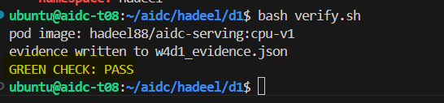

# Week 4 - Day 1: First Cluster

## Objective

The goal of this lab was to run my Week 2 serving container inside a Kubernetes cluster and access the API through Kubernetes instead of running it directly with Docker.

---

## Predictions

| Question | My Prediction | Result |
|---|---|---|
| Where does the cluster node live? | On the same team server I am working on. | Correct. The node was `aidc-t08`. |
| Why does `/health` return 503 before 200? | Because the application is still loading and is not ready yet. | Correct. The backend needs to become ready first. |
| Are `kubectl logs` and `docker logs` similar? | Yes, both should show the container application logs. | Correct. `kubectl logs serving` showed the Uvicorn logs. |
| Which pod refusal comes from the scheduler? | `Pending` | Correct. `pod-b` stayed Pending because it requested more CPU than available. |

---

## Environment

| Item | Value |
|---|---|
| Team Server | `aidc-t08` |
| Kubernetes | `k3s` |
| GPU | `NVIDIA RTX A6000` |
| GPU Resource | `nvidia.com/gpu: 1` |
| Docker Image | `hadeel88/aidc-serving:cpu-v1` |
| Backend | `echo` |
| Model ID | `Qwen/Qwen2.5-0.5B-Instruct` |

---

## Pod Failure Testing

In this lab, I tested three different pod failure cases.

| Pod | Status | Cause | Who Refused? |
|---|---|---|---|
| `pod-a` | `ImagePullBackOff` | The image tag did not exist. | Node / kubelet |
| `pod-b` | `Pending` | The pod requested more CPU than the node had available. | Kubernetes scheduler |
| `pod-c` | `CrashLoopBackOff` | The container started and then exited with code `3`. | Application / container |

These failures showed that not all pod errors happen for the same reason.

---

## Running the Serving Pod

After testing the broken pods, I deployed the correct serving pod using:

`hadeel88/aidc-serving:cpu-v1`

The pod started successfully:

`serving  1/1  Running`

The application logs showed:

`Uvicorn running on http://0.0.0.0:8000`

I also used these Kubernetes commands:

- `kubectl logs serving`
- `kubectl exec -it serving -- /bin/sh`
- `kubectl describe pod serving`

The pod events showed:

`Scheduled -> Pulled -> Created -> Started`

---

## API Testing

I used port forwarding to access the application:

`kubectl port-forward pod/serving 8001:8000`

Then I tested these endpoints:

| Endpoint | Result |
|---|---|
| `/health` | Working |
| `/v1/models` | Working |
| `/v1/chat/completions` | Working |

The chat completion endpoint returned a successful response from the model API.

---

## Verification

I ran:

`bash verify.sh`

The final result was:

`GREEN CHECK: PASS`

The script also created:

`w4d1_evidence.json`

### Verification Result

