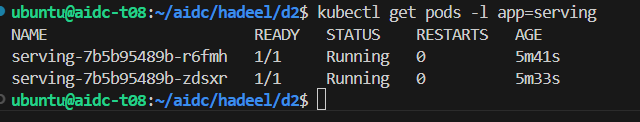
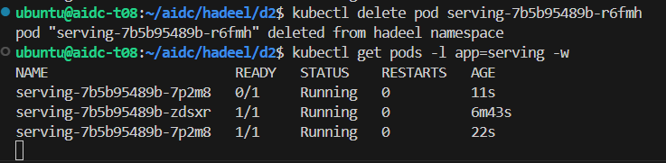
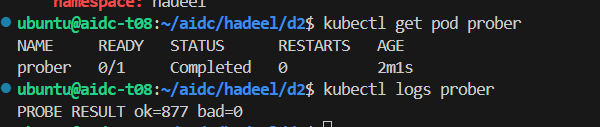
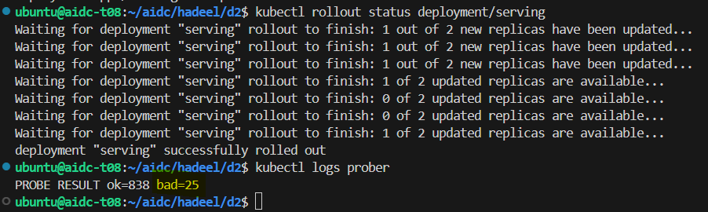
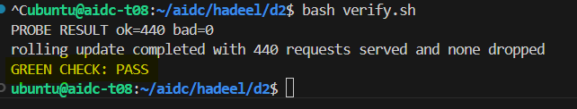

# Week 4 - Day 2: Make It Self-Healing

## Objective

The goal of this lab was to use a Kubernetes Deployment instead of a single pod, create a Service for the pods, add health probes, and test what happens when a pod is deleted or updated.

## Predictions

| Question | Prediction | Result |
|---|---|---|
| If one of the two pods is deleted while requests are running, how many requests will fail? | A few requests may fail while Kubernetes creates another pod. | No requests failed. The Service kept sending traffic to the available pod while the Deployment created a new one. |
| During a rolling update, how many requests will fail? | Maybe 1 or 2 requests will fail while the pods are being replaced. | No requests failed during the normal rolling update. |
| `/health` returns 503 while the backend is loading. Is it better for readiness or liveness? | Readiness, because the pod is running but may not be ready for traffic yet. | Readiness was the better choice. If liveness checks too early, Kubernetes may restart a pod that is still starting normally. |
| With Card C (`maxUnavailable: 1`, `maxSurge: 0`), how many requests will fail? | I thought a few requests might fail because there is no extra pod during the update. | In my run, 25 requests failed. The exact result can be different in another run. |

## Deployment and Service

I changed the single pod from Day 1 to a Deployment with two replicas.

The Service uses the label:

`app: serving`

This means the Service does not depend on the pod names. It can keep sending requests to the available pods even when their names change.

### Running Pods

## Health Probes

I added two probes to the Deployment:

| Probe | What it checks |
|---|---|
| `readinessProbe` | If the pod is ready to receive traffic |
| `livenessProbe` | If the application is still healthy or needs to restart |

Both probes check:

`GET /health` on port `8000`

For the liveness probe, I used an initial delay of 20 seconds to give the application time to start.

## Self-Healing Test

I deleted one of the two serving pods manually.

Kubernetes created a new pod automatically because the Deployment still had a desired state of two replicas.

While this was happening, the prober was sending requests to the Service.

Result:

`PROBE RESULT ok=879 bad=0`

So even though one pod was deleted, no requests failed.

## Rolling Update

I started another prober and changed the application version:

`kubectl set env deployment/serving APP_VERSION=v2`

Kubernetes replaced the pods one at a time instead of stopping both at once.

Result:

`PROBE RESULT ok=877 bad=0`

No requests failed during the rolling update.

The main settings used were:

| Setting | Value |
|---|---|
| `maxUnavailable` | `0` |
| `maxSurge` | `1` |
| Readiness Probe | Enabled |
| `preStop` | Enabled |

## Constraint Card C - No Headroom

For this test, I used Card C.

I changed the strategy to:

| Setting | Value |
|---|---|
| `maxUnavailable` | `1` |
| `maxSurge` | `0` |

This means Kubernetes cannot create an extra pod during the rollout.

### Prediction

I expected that some requests might fail because no extra pod could be created during the rollout.

### Result

`PROBE RESULT ok=838 bad=25`

In my test, 25 requests failed during the rollout.

This showed that Card C can reduce availability during an update because there is no extra capacity.

> Note: My teammates used the same Card C settings, but some of them got `bad=0`. This shows that the exact number of failed requests can be different between runs.

### Result

`PROBE RESULT ok=838 bad=25`

There were 25 failed requests. This showed the trade-off of Card C: it does not use extra capacity, but availability can be lower during the update.

## Final Verification

After the Card C test, I restored the original settings:

- `maxUnavailable: 0`
- `maxSurge: 1`

Then I ran:

`bash verify.sh`

Result:

`PROBE RESULT ok=440 bad=0`

`GREEN CHECK: PASS`

## Results Summary

| Test | OK | Failed |
|---|---:|---:|
| Delete one pod | 879 | 0 |
| Normal rolling update | 877 | 0 |
| Card C | 838 | 25 |
| Final verification | 440 | 0 |
