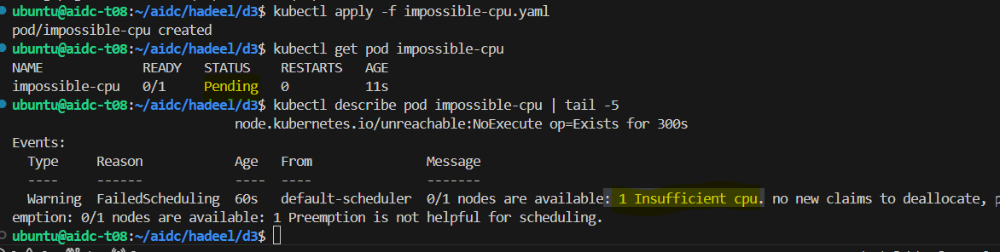
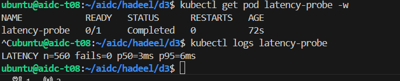
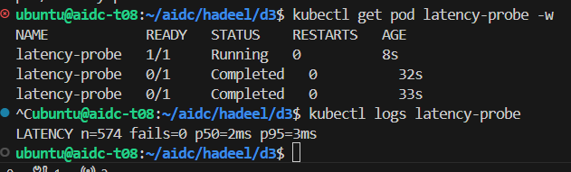
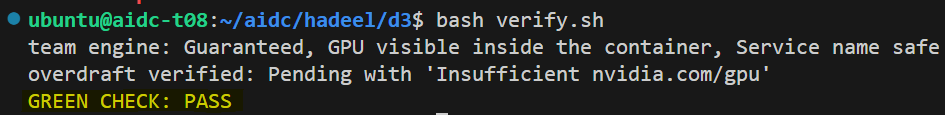

# Week 4 Day 3 - GPUs in the scheduler's ledger

In this lab, I learned how Kubernetes uses resource requests and limits when scheduling CPU and GPU workloads. I also tested how background CPU workloads can affect serving latency.

## Predictions

Before the lab, I thought that requesting more CPU than the node has would make `kubectl apply` fail.

I also thought that a pod requesting an unavailable GPU might start first and then fail.

For the CPU test, I expected limits to improve serving latency, but I was not sure how much difference they would make.

## CPU Scheduling

I created a pod requesting 64 CPUs:

```yaml
resources:
  requests:
    cpu: "64"
```

The YAML was accepted, but the pod stayed `Pending`.

The scheduler event showed:

```text
Insufficient cpu
```

This showed that the scheduler checks the requested resources before placing the pod on a node.



## GPU Scheduling

I also tested a pod requesting one GPU.

When the GPU was already allocated, another GPU request could not be scheduled and stayed `Pending`.

The final verification showed:

```text
Insufficient nvidia.com/gpu
```

I originally expected the container to start and then fail, but Kubernetes stopped it at the scheduling stage.

## CPU Neighbor Test

I tested the serving latency while 20 CPU burner pods were running.

### Unlimited CPU

Result:

```text
LATENCY n=560 fails=0 p50=3ms p95=6ms
```

**p95 = 6 ms**



### Limited CPU

The burner pods had a CPU limit of `500m`.

Result:

```text
LATENCY n=574 fails=0 p50=2ms p95=3ms
```

**p95 = 3 ms**



## Results

| Test | p95 | Failures |
| --- | ---: | ---: |
| Unlimited CPU neighbor | 6 ms | 0 |
| Limited CPU neighbor | 3 ms | 0 |

Limiting the background workload improved the serving p95 from **6 ms to 3 ms**.

## Resource Policy

I created `policy.md` for the three workloads:

- **Serving:** Guaranteed to protect its latency SLO.
- **Dashboard:** Uses spare resources for short refresh spikes.
- **Batch:** Has a low request and a tight CPU limit, so it is throttled first.

The latency results helped support this policy.

## Troubleshooting

At first, my serving pod was `OOMKilled` with exit code `137` because the `512Mi` memory limit was too low for my serving image.

I increased the memory limit to:

```yaml
memory: 4Gi
```

The model also needed more startup time, so I changed the liveness probe:

```yaml
initialDelaySeconds: 60
```

After these changes, the serving deployment became stable.

## Team GPU Engine

The team vLLM deployment was running in the `team` namespace.

The final verification confirmed:

- vLLM was running.
- The pod had Guaranteed QoS.
- The GPU was visible inside the container.
- The Service name was `team-serving`.
- A second GPU request stayed Pending because the GPU was already allocated.

## Final Verification

```text
team engine: Guaranteed, GPU visible inside the container, Service name safe
overdraft verified: Pending with 'Insufficient nvidia.com/gpu'
GREEN CHECK: PASS
```



## What I Learned

I learned that Kubernetes scheduling depends on resource requests and available capacity.

I also learned that CPU limits can reduce the effect of background workloads on a latency-sensitive service, and GPU resources are also tracked by the Kubernetes scheduler.
