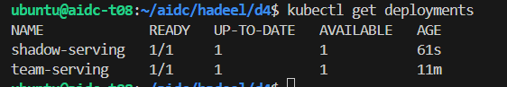
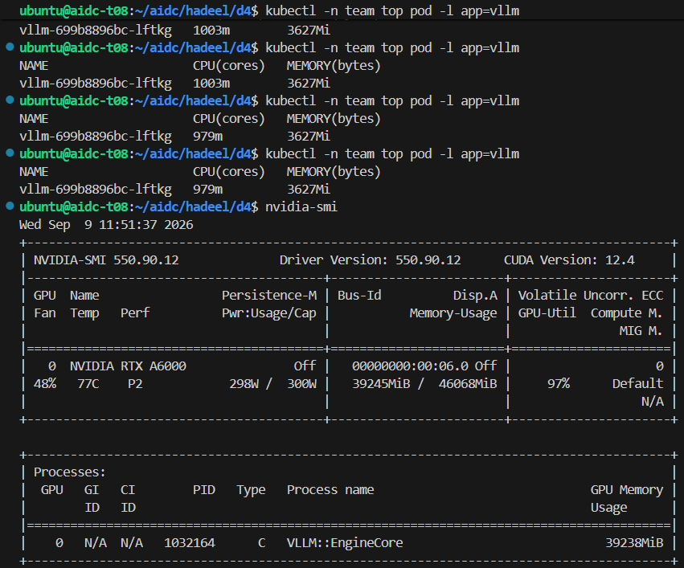
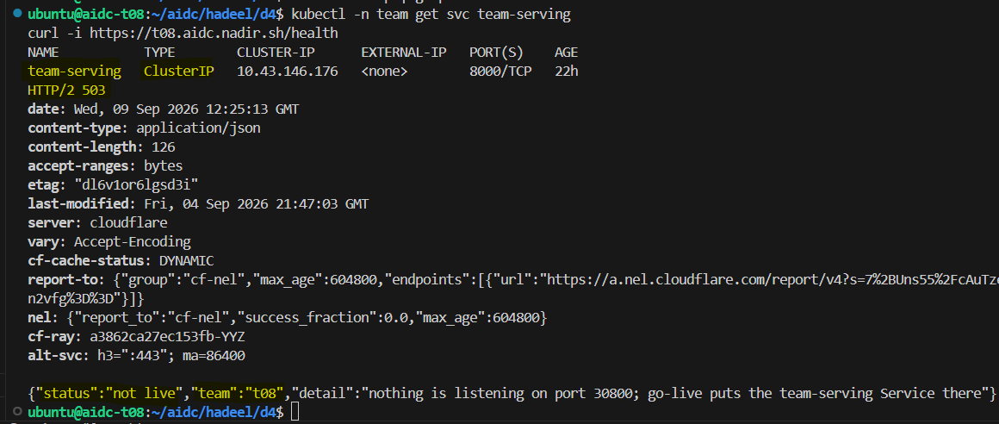
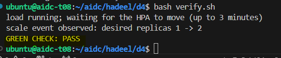

# Week 4 Day 4 - Package It, Then Let It Breathe

In this lab, I used Helm to deploy the serving stack and HPA to scale replicas automatically based on CPU usage.

## Predictions

1-Before the lab, I thought installing the same Helm chart twice might cause a conflict because both releases use the same templates.

2-For the HPA, our team chose the **Cost-capped** policy, so I expected the service to scale from 1 replica to 2 replicas under load.

3-I thought the replicas would return to 1 soon after the load stopped, but the scale-down took much longer than I expected.


## Helm

I installed the main release as `team` and another release as `shadow`.

Both worked at the same time:

```text
shadow-serving   1/1
team-serving     1/1
```

This showed that Helm release names allow the same chart to be installed more than once.



At first, my serving pod was `OOMKilled` because the `512Mi` memory limit was too low. I changed it to `4Gi` and increased the liveness startup delay to `60s`.

## HPA

Our team used the **Cost-capped** policy:

```text
Target CPU: 50%
Min replicas: 1
Max replicas: 2
```

Under load, the HPA scaled:

```text
1 -> 2 replicas
```

After the load stopped, it later returned:

```text
2 -> 1 replica
```

The scale-down took longer than I expected.

## vLLM CPU vs GPU

During the vLLM load test, CPU usage was about `1000m` out of a 4-core request, while GPU utilization reached `97%`.

This showed that CPU is not a good scaling signal for this GPU-bound workload.



I chose `vllm_num_requests_waiting` as a better signal and wrote the details in `hpa-failure-analysis.md`.

## Tunnel Test

Before go-live, the team service was still `ClusterIP`.

The public URL returned:

```text
HTTP/2 503
"status":"not live"
```

This was expected and confirmed that the tunnel and front door were working.



## Final Check

```text
scale event observed: desired replicas 1 -> 2
GREEN CHECK: PASS
```



## What I Learned

I learned how Helm manages releases, how HPA changes replica count under load, and why the scaling signal should match the type of workload.
