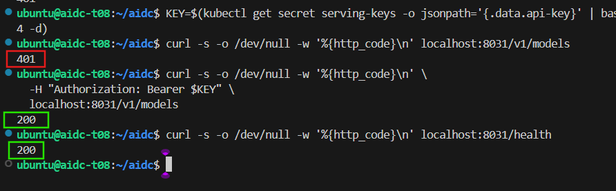
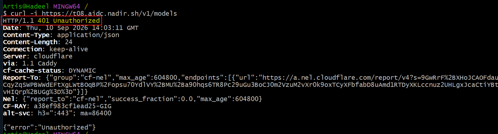
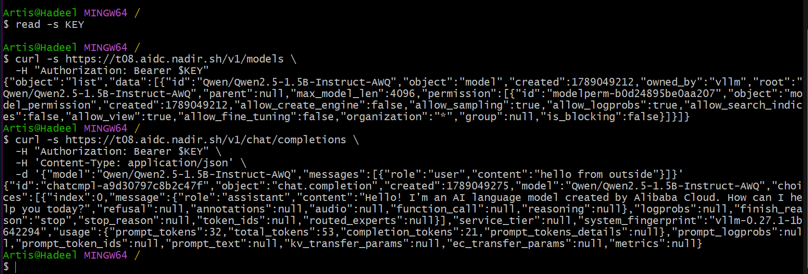
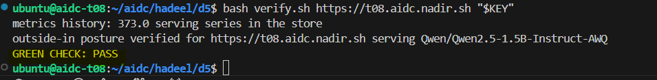

# Week 4 Day 5 - Go Live

In this lab, we prepared the team inference service for go-live.

## What I did

- Verified Bearer authentication on the API.
- Confirmed `/health` is publicly accessible.
- Confirmed `/v1/models` returns `401` without the API key.
- Tested the service successfully from outside the server.
- Verified the model:
  `Qwen/Qwen2.5-1.5B-Instruct-AWQ`
- Applied Prometheus and confirmed vLLM metrics are being collected.
- Created the integration note with the service URL, model, SLOs, and limits.
- Ran the final verification script successfully.

## Public Endpoint

`https://t08.aidc.nadir.sh`

## Evidence

### Authentication

### Unauthorized request from outside

### Successful outside smoke test

### Final Green Check

## Result

`GREEN CHECK: PASS`
