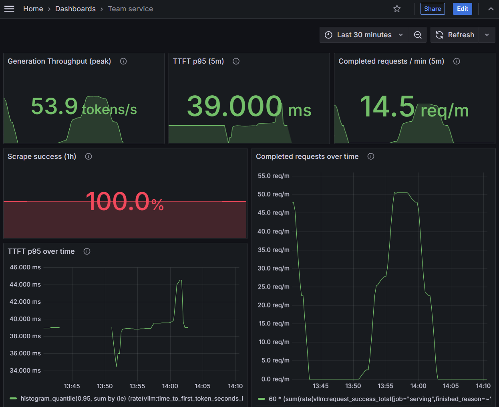
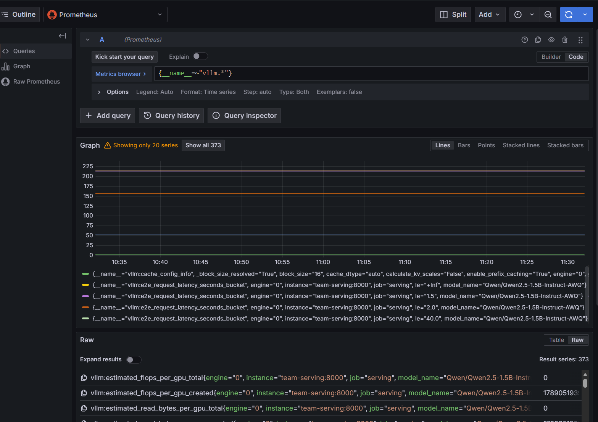
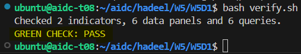

# Week 5 Day 1 - Service Dashboard

In this lab, we deployed Grafana and connected it to our existing Prometheus data to monitor the team vLLM service.

## What I did

- Deployed Grafana in the `team` namespace.
- Connected Grafana to Prometheus.
- Verified that Prometheus is successfully scraping the serving service.
- Generated artificial traffic using `traffic.py`.
- Created the `Team service` dashboard.
- Monitored service metrics including:
  - TTFT p95
  - Completed requests per minute
  - Generation throughput
  - Scrape success
- Documented the selected SLIs and provisional SLO targets.
- Exported the dashboard as `my-dashboard.json`.
- Verified the final dashboard and SLO files successfully.

## Service

Model:

`Qwen/Qwen2.5-1.5B-Instruct-AWQ`

Namespace:

`team`

## Evidence

### Final Grafana Dashboard



### Prometheus Metrics



### Verification



## Result

```text
Checked 2 indicators, 6 data panels and 6 queries.
GREEN CHECK: PASS
