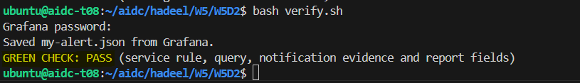

# Week 5 Day 2 - Alerts and Service Report

In this lab, we configured Grafana alerts for the team vLLM service and verified that alert notifications can be delivered through a webhook receiver.

## What WE did

- Reused the existing Grafana and Prometheus setup.
- Configured the `Lab inbox` webhook contact point.
- Created the `Team service alert` using the completed requests per minute metric.
- Used a threshold of below 20 requests/min based on the documented SLO target.
- Created the `Lab notification test` rule using an artificial Prometheus signal.
- Verified both `firing` and `resolved` notifications in the webhook receiver logs.
- Paused the notification test after recovery.
- Saved the notification evidence to `notification-evidence.jsonl`.
- Completed the service report in `my-service-report.md`.
- Exported the service alert to `my-alert.json`.
- Verified the final lab successfully.

## Service Alert

Indicator:

`Completed requests per minute`

Condition:

`Below 20 requests/min`

Evaluation interval:

`1 minute`

## Notification Test

The artificial test rule was used to confirm that Grafana could send both firing and resolved notifications to the `Lab inbox` webhook receiver.

## Final Verification



```text
Saved my-alert.json from Grafana.
GREEN CHECK: PASS (service rule, query, notification evidence and report fields)
